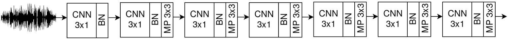
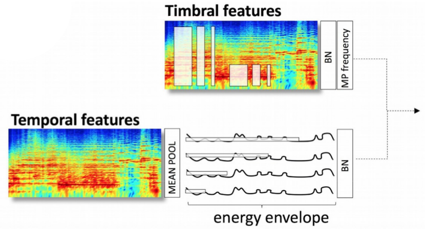
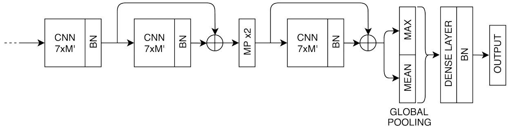

## End-to-end learning for music audio tagging at scale
The lack of data tends to limit the outcomes of deep learning research - specially, when dealing with end-to-end learning stacks processing raw data such as waveforms. In this study we make use of musical labels annotated for 1.2 million tracks. This large amount of data allows us to unrestrictedly explore different front-end paradigms: from assumption-free models - using waveforms as input with very small convolutional filters; to models that rely on domain knowledge - log-mel spectrograms with a convolutional neural network designed to learn temporal and timbral features. Results suggest that while spectrogram-based models surpass their waveform-based counterparts, the difference in performance shrinks as more data are employed.

Are you curious to see how our models work? We have a **demo**: http://www.jordipons.me/apps/music-audio-tagging-at-scale-demo/

Are you searching for **pre-trained models**? We have recently released the musicnn library, with models trained with the MagnaTagATune and the Million Song Dataset: https://github.com/jordipons/musicnn 

**Reference:** Pons, J., Nieto, O., Prockup, M., Schmidt, E., Ehmann, A., Serra, X., End-to-End Learning for Music Audio Tagging at Scale. Proc. of the 19th International Society for Music Information Retrieval Conference (ISMIR). Paris, France, 2018 ([PDF](https://ccrma.stanford.edu/~urinieto/MARL/publications/ISMIR2018-Pons.pdf)). 

## Models
The following models were used in our study, and their tensorflow implementation is available in `models.py`. We study two models that are based on two conceptually very different design principles. The first is based on a waveform front-end, and no decisions based on domain knowledge inspired its design. The assumptions of this model are reduced to its minimum expression: raw audio is set as input, and the used CNN does minimal assumptions over the structure of the data due to its set of very small filters. For the second model, with a spectrogram front-end, we make use of domain knowledge to guide the design of our model.

### Waveform front-end	

It is based on the *sample-level* front-end proposed by Lee, et al. [1]:

Each layer has 64, 64, 64, 128, 128, 128 and 256 filters respectively. Via hierarchically combining small-context representations and making use of max pooling, the *sample-level* front-end delivers a feature map of an audio segment.

### Spectrogram front-end

The proposed front-end is a single-layer CNN with many filter shapes that are grouped into two branches [2]: (i) top branch - timbral features [3]; and (ii) lower branch - temporal features [4].

The top branch is designed to capture pitch-invariant timbral features that are occurring at different time-frequency scales in the spectrogram. Pitch invariance is enforced via enabling CNN filters to convolve through the frequency domain, and via max-pooling the feature map vertical axis [3]. 

The lower branch is meant to learn temporal features, designed to efficiently capture different time-scale representations by using several filter shapes. But note that CNN filters operate over an energy envelope (not directly over the spectrogram) obtained via mean-pooling the frequency-axis of the spectrogram [4].

### Back-end
In order to allow a fair comparison among models, the previous front-ends share this same back-end.

It is conformed by three CNN layers (with 512 filters each and two of those having residual connections), two pooling layers and a dense layer. We found this filter shapes setup [5] to be (i) computationally efficient and (ii) shaped such that all extracted features are considered across a reasonable amount of temporal context (note the 7 x M' filter shapes, representing *time* x *all features*).

We also make a drastic use of temporal pooling: firstly, via down-sapling x2 the temporal dimensionality of the CNNs feature map; and secondly, by making use of a global pooling layer. The global pooling strategy allows
for variable length inputs to the network. Finally, a dense layer connects the pooled features to the output.

## References

[1] Lee, et al. *Sample-level Deep Convolutional Neural Networks for Music Auto-tagging Using Raw Waveforms* in arXiv:1703.01789. (2017, May)

[2] Pons, et al. *Experimenting with musically motivated convolutional neural networks* in 14th International Workshop on Content-Based Multimedia Indexing (CBMI2016). Publisher: IEEE. (2016, June)

[3] Pons, et al. *Timbre Analysis of Music Audio Signals with Convolutional Neural Networks* in 25th European Signal Processing Conference (EUSIPCO2017). Publisher: IEEE.  (2017, September) 

[4] Pons & Serra. *Designing efficient architectures for modeling temporal features with convolutional neural networks* in 42nd IEEE International Conference on Acoustics, Speech and Signal Processing (ICASSP2017). Publisher: IEEE. (2017, March)

[5] Dieleman & Schrauwen. *End-to-end learning for music audio* in 39nd IEEE International Conference on Acoustics, Speech and Signal Processing (ICASSP2014). Publisher: IEEE. (2014, May)
